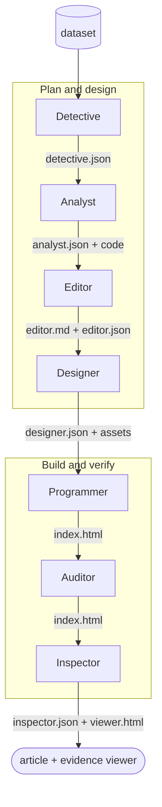

# Data2Story

A data-journalist agent skill that turns any dataset into a verifiable, evidence-grounded multimodal story — a self-contained HTML article where every sentence traces back to the data or source that justifies it.

[](https://data2story.github.io/)
[](https://arxiv.org/abs/2606.11176)
[](LICENSE)

## What it does

https://github.com/user-attachments/assets/7a2e2b65-3289-431d-b06a-230252df8774

- **Dataset → finished article.** Point it at a CSV, a folder of data, or a paper, and a fixed pipeline of seven roles produces a publishable HTML story end to end.
- **Evidence-grounded.** Every sentence and visual links back to its source. The pipeline emits a `viewer.html` inspector where you can click any claim to see the data, code, or citation behind it.
- **Multimodal by default.** Charts, images, video, audio, maps, and interactive elements — chosen from the data's actual properties, not a fixed checklist. Media generation routes through OpenRouter.
- **Verifiable.** Each run writes to its own versioned project folder and snapshots the exact skill versions used, so every result can be traced and re-checked.
- **Progressive disclosure.** Each role's `SKILL.md` holds only its instructions; bulky reference material (output schemas, field rules, lookup tables) lives in that role's `references/` folder as JSON and is loaded only when needed.

## Updates
* [x] [2026.6] Version 0.1.0: Optimized visual effects.
* [x] [2026.6.9] Released the arXiv paper, GitHub repository.
* [x] [2026.5.11] Data2Story was accepted as a Spotlight paper at the [ACM Conference on AI and Agentic Systems workshop](https://www.caisconf.org/).

## Installation & usage

Data2Story is an agent skill. The orchestrator lives in `skills/data2story/SKILL.md` — it works first-class with Claude Code, and equally with Codex, Cursor, Gemini CLI, and other agents.

1. Set your API key. Media generation routes through [OpenRouter](https://openrouter.ai/) by default:

   ```bash
   export OPENROUTER_API_KEY=sk-or-...
   ```

2. Run the skill on a dataset:

   - **Claude Code** — make the skill available (place `skills/data2story/` under `~/.claude/skills/`, or run from inside this repo), then:

     ```
     /data2story data/pick_a_card
     ```

   - **Codex / other agents** — open the repo and ask the agent to follow the orchestrator:

     ```
     Read skills/data2story/SKILL.md and run the Data2Story pipeline on data/pick_a_card
     ```

3. Open the output: `index.html` (the finished article) and `viewer.html` (the evidence inspector).

## Project structure

```
data2story-skill/
├── skills/
│   ├── data2story/        the agent: SKILL.md (orchestrator) + one folder per role
│   │                      each role = SKILL.md + references/ (JSON) + scripts/ (the tools it runs)
│   │                        · designer/scripts/  — OpenRouter media tools (text→image/video/music, embeddings)
│   │                        · inspector/scripts/ — verify.py + generate_viewer.py
│   │                        · detective/scripts/ — Wikimedia/Commons fetch helpers
│   └── frontend-design/   shared UI/visual design system the Designer & Programmer borrow from
├── data/     example datasets
└── assets/   shared images
```

## The virtual newsroom

Think of it as a small newsroom in a box. Each role reads what the previous one produced, then adds its own artifact — a fixed pipeline that runs once, end to end.

| # | Role | What it does | Produces |
|---|------|--------------|----------|
| 1 | **Detective** | Researches external context — domain background, history, why the data matters | `detective.json` |
| 2 | **Analyst** | Exhaustively profiles the data — distributions, correlations, trends, anomalies | `analyst.json`, `code/*.py` |
| 3 | **Editor** | Decides the narrative — what the article argues and which findings matter | `editor.md`, `editor.json` |
| 4 | **Designer** | Chooses how to show each point — charts, images, video, audio, interactives | `designer.json`, `assets/` |
| 5 | **Programmer** | Builds the final HTML, tagging every element with its source IDs | `index.html` |
| 6 | **Auditor** | Fixes layout issues — overlap, spacing, alignment — without changing content | `index.html` (fixed), `auditor.json` |
| 7 | **Inspector** | Verifies every sentence traces to its evidence; builds an interactive viewer | `inspector.json`, `viewer.html` |




## License

Released under the [MIT License](LICENSE).

## Acknowledgement

If you use Data2Story in your research, please kindly cite:

```bibtex
@article{data2story,
  title   = {Data Journalist Agent: Transforming Data into Verifiable Multimodal Stories},
  author  = {Lin, Kevin Qinghong and EI, Batu and Shi, Yuhong and Lu, Pan and Torr, Philip and Zou, James},
  journal = {arXiv preprint arXiv:2606.11176},
  year    = {2026}
}
```
