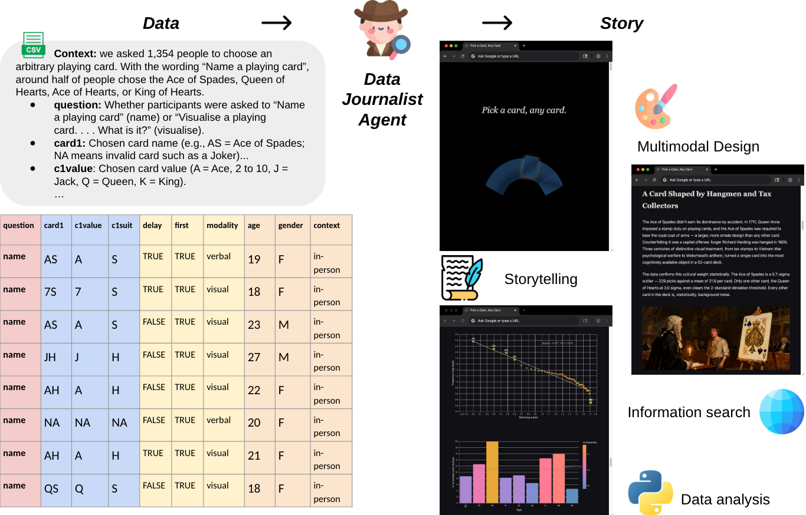
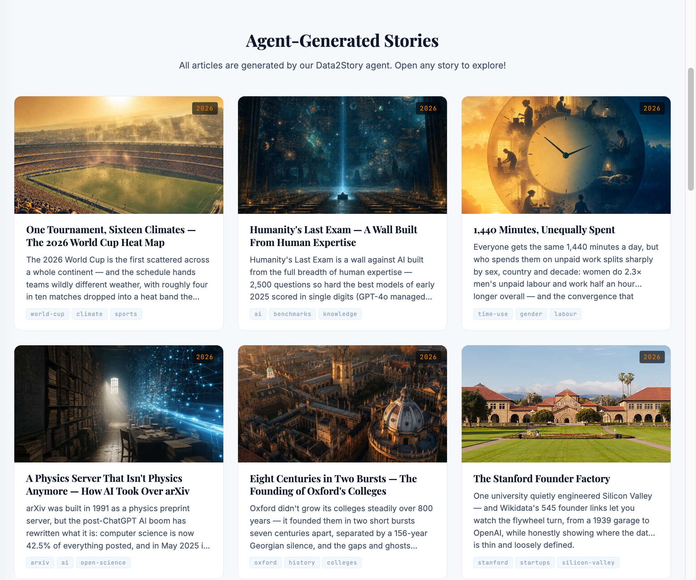
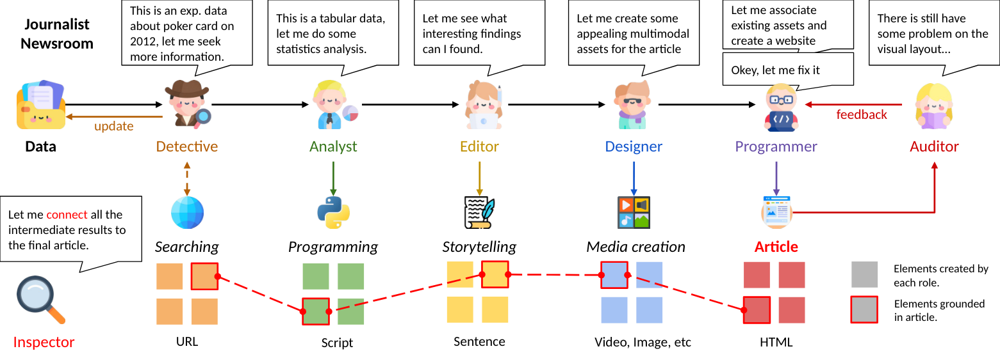

# Data2Story

<p align="center">
        &nbsp&nbsp 🌐 <a href="https://data2story.github.io/">Website</a> &nbsp&nbsp 
        | &nbsp&nbsp 📑 <a href="https://arxiv.org/abs/2606.11176">Paper</a> &nbsp&nbsp 
</p>

<!-- [](https://hits.seeyoufarm.com) -->

<p align="center">
<b>TL;DR:</b> A data-journalist agent that turns any dataset into a verifiable, evidence-grounded multimodal story.
</p>

<p align="center">

</p>

> **Data Journalist Agent: Transforming Data into Verifiable Multimodal Stories**<br>
> [Kevin Qinghong Lin](https://qhlin.me/), [Batu EI](https://ellabs.ai/#/works), [Yuhong Shi](https://www.linkedin.com/in/yuhong-shi-134a7b3b5/), [Pan Lu](https://lupantech.github.io/), [Philip Torr](https://eng.ox.ac.uk/people/philip-torr), [James Zou](https://www.james-zou.com/)
> <br>University of Oxford, Stanford University<br>

## 🖼️ Gallery

Curious what it produces? Browse real example stories in the gallery on our [website](https://data2story.github.io/) before you start.

<p align="center">
<a href="https://data2story.github.io/"></a>
</p>

## 🚀 Quick Start

Data2Story is an agent skill. The orchestrator lives in [`skills/SKILL.md`](skills/SKILL.md) — point any coding agent at it. It works first-class with [Claude Code](https://claude.com/claude-code), and equally with [Codex](https://openai.com/codex/) and other agents (Cursor, Gemini CLI, etc.).

```
data2story-skill/
├── assets/        # logo and shared assets
└── skills/        # the agent: SKILL.md + one folder per role
    ├── detective/ analyst/ editor/ designer/    # each role = SKILL.md + references/ (JSON) + scripts/ (its tools)
    └── programmer/ auditor/ inspector/          # media tools → designer/scripts/, inspector → inspector/scripts/
```

**1. Set up your API key.** Media generation routes through [OpenRouter](https://openrouter.ai/) by default (you can swap in another provider):

```bash
export OPENROUTER_API_KEY=sk-or-...
```

**2. Run the skill** by pointing your agent at a dataset:

- **Claude Code** — make the skill available to Claude Code (place `skills/` under `~/.claude/skills/`, or run from inside this repo), then invoke it:

  ```
  /data2story data/pick_a_card
  ```

- **Codex / other agents** — open the repo and ask the agent to follow the orchestrator:

  ```
  Read skills/SKILL.md and run the Data2Story pipeline on data/pick_a_card
  ```

**3. Open the output.** Each run writes a self-contained article and an evidence viewer:

- `index.html` — the finished multimodal article
- `viewer.html` — the evidence-grounded inspector, where every sentence traces back to its source

Each run creates its own **versioned project folder** and snapshots the exact skill versions used, so results are verifiable.

---

## 🏢 The Virtual Newsroom

Think of it as a small newsroom in a box. Each role reads what the previous one produced, then adds its own artifact — a fixed pipeline that runs once, end to end.

<p align="center">

</p>

```
   ┌──────┐
   │ DATA │
   └──┬───┘
      ▼
   Detective → Analyst → Editor → Designer → Programmer → Auditor → Inspector
                                                                        │
                                                                        ▼
                                              final index.html  +  viewer.html (evidence-grounded)
```

| # | Role | What it does | Produces |
|---|------|--------------|----------|
| 1 | 🕵️ **Detective** | Researches external context — domain background, history, why the data matters | `detective.json` |
| 2 | 📊 **Analyst** | Exhaustively profiles the data — distributions, correlations, trends, anomalies | `analyst.json`, `code/*.py` |
| 3 | ✍️ **Editor** | Decides the narrative — what the article argues and which findings matter | `editor.md`, `editor.json` |
| 4 | 🎨 **Designer** | Chooses how to show each point — charts, images, video, interactives | `designer.json`, `assets/` |
| 5 | 💻 **Programmer** | Builds the final HTML, tagging every element with its source IDs | `index.html` |
| 6 | 🔧 **Auditor** | Fixes layout issues — overlap, spacing, alignment — without changing content | `index.html` (fixed), `auditor.json` |
| 7 | 🔍 **Inspector** | Verifies every sentence traces to its evidence; builds an interactive viewer | `inspector.json`, `viewer.html` |
