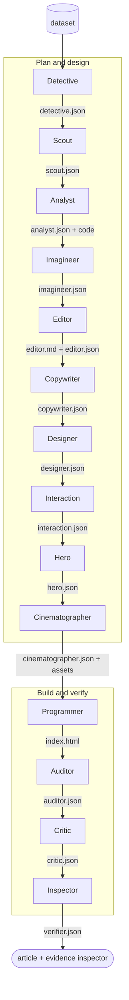

# Data2Story Pro


A data-journalist agent skill that turns any dataset into a verifiable, evidence-grounded multimodal story — a self-contained HTML article where every sentence traces back to the data or source that justifies it.

[](https://data2story.github.io/)
[](https://arxiv.org/abs/2606.11176)
[](../../LICENSE)

> **The extended build — two Stage-0 profiles.** `data2story-pro` is the full newsroom. At Stage 0 it selects one of two run profiles:
>
> - **fast** (~15–25 min) — the 7 canonical roles only: charts, static images, and the in-page traceability inspector.
> - **premium** (~2h40–2h50, the default) — the full 14-agent pipeline: a cinematic scroll background, interactive playgrounds, an animated cover, and the runnable in-page verify layer.
>
> For the paper's canonical version — the top-level 7-role pipeline that reproduces the article — use the sibling [`../data2story/`](../data2story/) skill (invoked as `/data2story`); the two-version overview is in the [repository README](../../README.md). Paths below are relative to this `skills/data2story-pro/` folder; install by copying the whole `skills/` tree, or run from the repository root.

## What it does


- **Dataset → finished article.** Point it at a CSV, a folder of data, or a paper, and a fixed pipeline of seven roles — a virtual newsroom — produces a publishable HTML story end to end.
- **Or start from an idea.** Hand it a bare topic instead of a dataset and it runs an `ideation` front-stage: it converges your hunch into a concrete, data-backed topic through a `sparring-partner` dialogue, then acquires a real, validated dataset via `find-data` (with a checkpoint after each) before the newsroom runs. Real data only — if no real dataset supports the idea, it stops honestly rather than inventing one.
- **Evidence-grounded — and runnable.** Every sentence and visual links back to its source. The pipeline builds an evidence inspector *into* the article itself — open `index.html` and click any claim to see the data, code, or citation behind it in the in-page panel. A computed claim also gets a **Run** button that recomputes the figure in-browser (lazy Pyodide), and every run ships a **reproducible notebook** that re-derives the headline numbers from the raw data — the paper's coding verifier, one click from the reader.
- **Multimodal by default.** Charts, images, video, audio, maps, and interactive elements — chosen from the data's actual properties, not a fixed checklist. Media generation routes through OpenRouter.
- **Verifiable.** Each run writes to its own versioned project folder and snapshots the exact skill versions used, so every result can be traced and re-checked.
- **Progressive disclosure.** Each role's `SKILL.md` holds only its instructions; bulky reference material (output schemas, field rules, lookup tables) lives in that role's `references/` folder as JSON and is loaded only when needed.

## Updates
* [x] [2026.6] Version 0.0.1: Optimized visual effects.
* [x] [2026.6.9] Released the arXiv paper, GitHub repository.
* [x] [2026.5.11] Data2Story was accepted as a Spotlight paper at the [ACM Conference on AI and Agentic Systems workshop](https://www.caisconf.org/).

## Installation & usage

Data2Story is an agent skill. The orchestrator lives in `skills/data2story-pro/SKILL.md` — it works first-class with Claude Code, and equally with Codex, Cursor, Gemini CLI, and other agents.

1. Set your API key. Media generation routes through [OpenRouter](https://openrouter.ai/) by default:

   ```bash
   export OPENROUTER_API_KEY=sk-or-...
   ```

   > On macOS/Linux (or any non-default Chrome install), set `CHROME_PATH` to your Chrome/Chromium binary so the Auditor's browser render/playtest step can find it (e.g. `export CHROME_PATH=/usr/bin/chromium`). Windows installs are auto-detected.

   > **Optional dependencies — the skill degrades gracefully without them.** A few helper scripts use extra packages for full fidelity; install to enable everything, or skip and the pipeline still runs (each missing package just disables one feature, with a warning):
   > - **Python:** `pip install pandas openpyxl pillow imageio-ffmpeg` — Data-is-Plural querying, `.xlsx` parsing, and web-weight image/audio/video optimization.
   > - **Node:** `npm install` — `puppeteer-core` for the Auditor's live browser render + playtest checks (skipped, not failed, when absent).

2. Run the skill on a dataset. Point it at your own dataset folder — a CSV, a JSON file, or a folder of data:

   - **Claude Code** — make the skills available. Data2Story depends on its sibling skills (`frontend-design-pro/`, `dataviz-craft/`, and — for idea mode — `find-data/` + `sparring-partner/`) via relative paths, so copy the **whole `skills/` tree** under `~/.claude/skills/` (not just `skills/data2story-pro/`), or run from the repository root. Then:

     ```
     /data2story-pro data/<your_dataset>/
     ```

   - **Codex / other agents** — open the repo and ask the agent to follow the orchestrator:

     ```
     Read skills/data2story-pro/SKILL.md and run the Data2Story pipeline on data/<your_dataset>/
     ```

   **Two speeds — premium (default) or fast.** By default Data2Story runs the full **premium** flagship: the 14-agent newsroom — cinematic scroll, interactive playgrounds, an animated cover, and the runnable verify layer (~2h40–2h50). Append **`--fast`** for the **7-role baseline** — charts + static images + the in-page traceability inspector, ~15–25 min:

   ```
   /data2story-pro data/<your_dataset>/ --fast
   ```

   Run interactively with no flag and it asks which you want; an automated/headless call with no flag defaults to premium.

   **No dataset? Start from an idea.** Pass a bare topic or question instead of a path:

   ```
   /data2story-pro "how have global coffee prices moved against rainfall in Brazil?"
   ```

   It will converge the topic with you and find a real, validated dataset before building anything. (A `http(s)://` link is also accepted — it is fetched and validated like a dataset.)

3. Open the output: `index.html` — the finished article, with the evidence inspector built in as an in-page panel (click any claim to trace its source). It is a single self-contained file; there is no separate viewer to open.

## Project structure

```
data2story-skill/
├── skills/
│   ├── data2story/            the paper's canonical 7-role version (/data2story) — reproduces the article
│   ├── data2story-pro/    ←   THIS skill (/data2story-pro)
│   │   ├── SKILL.md           the orchestrator + one folder per role
│   │   │                      each role = SKILL.md + references/ (JSON) + scripts/ (the tools it runs)
│   │   │                        · designer/scripts/  — OpenRouter media tools (text→image/video/music, embeddings)
│   │   │                        · inspector/scripts/ — verify.py + generate_viewer.py + validate.py (contract gate)
│   │   │                        · detective/scripts/ — image/flag/logo fetch helpers (Openverse, Wikimedia)
│   │   │                        · ideation/          — the idea-mode front-stage that orchestrates
│   │   │                                               sparring-partner + find-data before the newsroom
│   │   ├── package.json       Node deps for the Auditor's browser render/playtest (npm install)
│   │   └── data/          ←   drop your input dataset here (none are bundled — bring your own)
│   ├── frontend-design-pro/   extended UI/visual design system the Designer & Programmer borrow from
│   ├── dataviz-craft/         shared data-visualization recipes the Designer & Programmer borrow from
│   ├── find-data/             dataset discovery + 4-gate validation — the gatekeeper before the
│   │                          newsroom; also used by idea mode to acquire a real dataset
│   └── sparring-partner/      the anti-sycophantic brainstorming dialogue reused by idea mode
└── README.md · LICENSE · assets/   shared at the repository root (→ ../../LICENSE, ../../assets)
```

## The virtual newsroom

Think of it as a small newsroom in a box: the paper's **seven roles**, each reading what the previous one produced and adding its own artifact — a fixed pipeline that runs once, end to end. Five of those seven roles are staffed as small **teams** (a lead + specialist members), so the newsroom runs **14 agents** in total while the seven-role structure of the paper stays intact. (Idea mode's `ideation` front-stage runs *upstream* of this table — it secures a real dataset before the newsroom starts and is not one of the 14 newsroom agents.)

| # | Role | Team | What it does | Produces |
|---|------|------|--------------|----------|
| 1 | **Detective** | Detective (lead) | Researches external context — domain background, history, why the data matters | `detective.json` |
| 2 | **Scout** | Detective | Sources + verifies external media — license-clean BGM, real photos/video of the subjects, live status (each license- and identity-checked) | `scout.json`, `assets/scout_*` |
| 3 | **Analyst** | Analyst (lead) | Exhaustively profiles the data — distributions, correlations, trends, anomalies | `analyst.json`, `code/*.py` |
| 4 | **Imagineer** | Analyst | Fans out candidate interactive concepts grounded in the data + narrative for the Editor to curate | `imagineer.json` |
| 5 | **Editor** | Editor (lead) | Decides the narrative — what the article argues, which findings matter, which interactives to build | `editor.md`, `editor.json` |
| 6 | **Copywriter** | Editor | Titles the piece — masthead, section titles, figure captions — to a research-driven standard (strings only; changes no finding, number, or id) | `copywriter.json` |
| 7 | **Designer** | Designer (lead) | Chooses how to show each point — charts, images, video, audio, interactives | `designer.json`, `assets/` |
| 8 | **Interaction** | Designer | Builds the curated set of explorable playgrounds — the hero centerpiece + supporting ones | `interaction.json` |
| 9 | **Hero** | Designer | Crafts the cover — an animated hero video (cinemagraph / image2video / Ken-Burns), static only as a recorded fallback | `hero.json`, `assets/teaser.*` |
| 10 | **Cinematographer** | Designer | Mandatory cinematic scroll background (photographic / generative / data-driven mode), staging the visuals as scenes — every blog ships one | `cinematographer.json` |
| 11 | **Programmer** | Programmer (lead) | Builds the final HTML, tagging every element with its source IDs | `index.html` |
| 12 | **Auditor** | Auditor (lead) | Renders the page in a real browser; fixes layout/overflow/broken-media without changing content | `index.html` (fixed), `auditor.json` |
| 13 | **Critic** | Auditor | Scores the finished article against the quality rubric and sends targeted fixes back | `critic.json` |
| 14 | **Inspector** | Inspector (lead) | Verifies every sentence traces to its evidence; builds the in-page evidence inspector + the reproducible notebook (the paper's coding verifier) | `verifier.json`, `verify/` |

These seven roles are seven **teams**: two are a single agent, five add specialist team members — **Detective** + **Scout** (verified media), **Analyst** + **Imagineer** (interactive ideation), **Editor** + **Copywriter** (titling & captioning), **Designer** + **Interaction** (the explorable centerpiece) + **Hero** (the animated cover) + **Cinematographer** (the cinematic scroll), and **Auditor** + **Critic** (content-quality review) — so the newsroom runs 14 agents in total.




## License

Released under the [MIT License](../../LICENSE).

## Acknowledgement

If you use Data2Story in your research, please kindly cite:

```bibtex
@article{data2story,
  title   = {Data Journalist Agent: Transforming Data into Verifiable Multimodal Stories},
  author  = {Lin, Kevin Qinghong and EI, Batu and Shi, Yuhong and Lu, Pan and Torr, Philip and Zou, James},
  journal = {arXiv preprint arXiv:2606.11176},
  year    = {2026}
}
```
